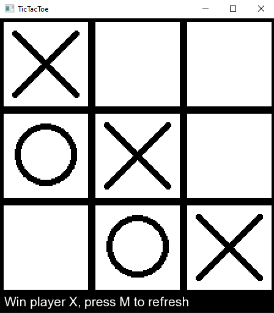
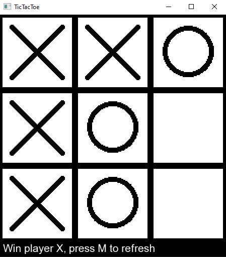
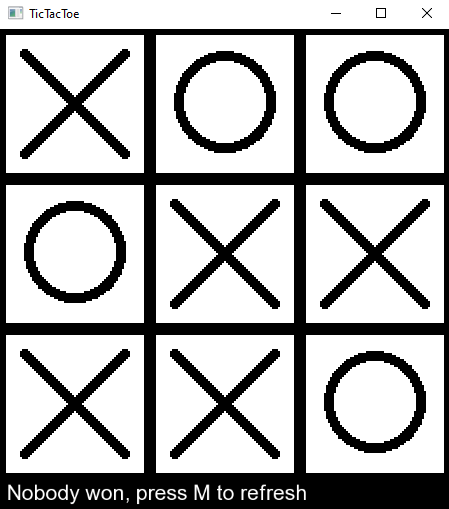

# TicTacToe

## Description
Here's the TicTacToe Project. This is a classic game of Tic-Tac-Toe, implemented in C++ using SFML library. The game allows two players to place X and O in a 3x3 grid. The player who succeeds in placing three of their marks in a horizontal, vertical, or diagonal row wins the game.

## View

 

 

## About Project

This project was created to demonstrate basic programming skills, including implementing game logic, handling user interactions, and designing a simple user interface. Cmake was used to manage the project and the SFML library was used to create the window and interactions. Take a look if you're interested.

